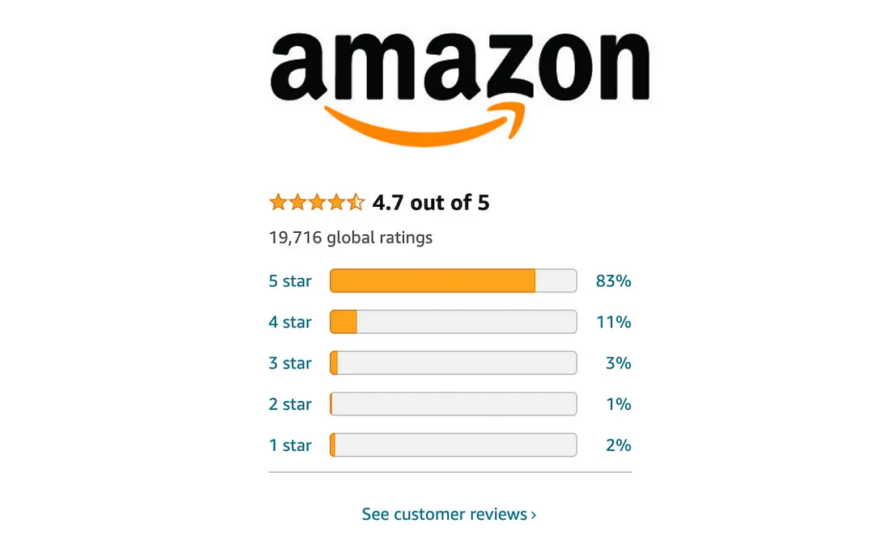

# Amazon-Review-Sentiment-Analysis-Project

 

## Business Problem

**Kozmos**, a company focused on producing home textiles and casual wear, conducts its sales through Amazon. By analyzing the reviews of their products and improving their features based on received complaints, they aim to increase their sales. In line with this goal, sentiment analysis will be performed on the reviews, which will be tagged and used to create a classification model.

## Dataset Story

The dataset consists of variables indicating the comments made on a specific product group, the title of the comment, the star rating, and the number of people who found the comment helpful.

## Features of Dataset

- **Total Features :** 4
- **Total Row :** 5.611
- **CSV File Size :** 489 KB

## Variable Descriptions

**Star:** The number of stars given to the product

**Helpful:** The number of people who found the comment helpful

**Title:** The title given to the content of the comment, short review

**Review:** The comment made on the product
